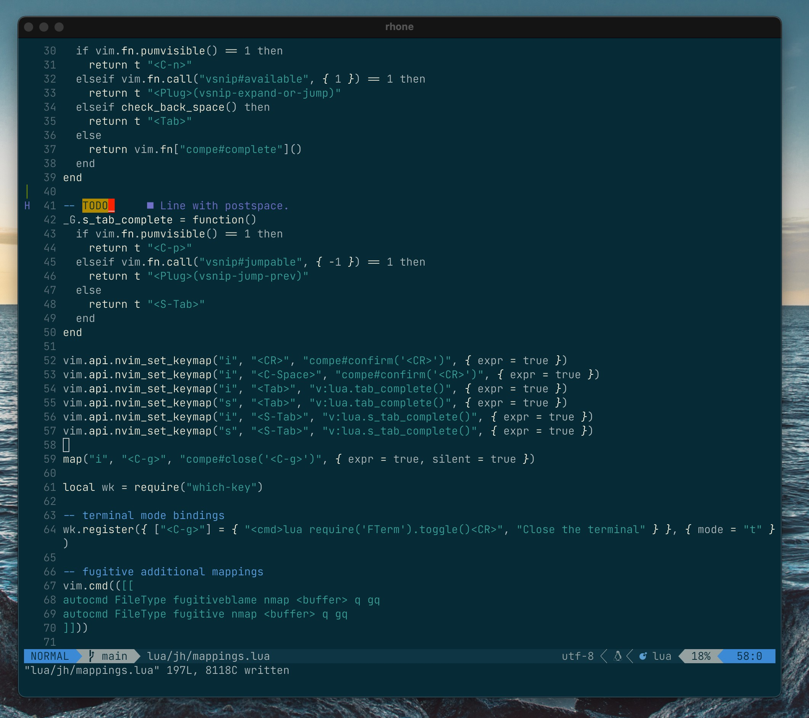

# Neovim 0.5 config

A very opinionated configuration, with strong reminiscence of [Doom-Emacs](https://github.com/hlissner/doom-emacs), written in Lua.

## Core Principles

1. Comfort: I use this everyday, it has to be nice and enjoyable.
2. Fast: it must be extremely responsive, period.
3. Discoverable: stuff I cannot discover has no value.
4. Modern: favour Lua as long as it doesn't go against the above principles.

## General overview

- Most of the bindings are behind `<leader>` which is set to `Space`. Relies on [WhichKeys](https://github.com/folke/which-key.nvim) for discoverability.
- Filetype specific bindings are behind `<leader><leader>`.
- [Telescope](https://github.com/nvim-telescope/telescope.nvim) and [FZF](https://github.com/junegunn/fzf.vim).
- [LSP](https://microsoft.github.io/language-server-protocol/) centric.
- [Treesitter](https://github.com/tree-sitter/tree-sitter) for syntax highlighting and manipulations.
- [Colemak](https://colemak.com) keyboard layout; nothing is moved, but [EasyMotion](https://github.com/easymotion/vim-easymotion) keys are using Colemak home row.
- `<C-g>` is often bound to get out of popups.
- Very basic notes support written in Markdown, centralized in a folder. See the `jh.notes` module of this repository.
- Organized as following:
  - `init.lua` basic options and sensible defaults. Other files are loaded from there.
  - `jh/plugins.lua` dependencies and their basic configuration.
  - `jh/mappings.lua` general mappings, independant of any filetype.
  - `jh/utils.lua` set of little functions used here and here across the configuration.
  - `jh/*.lua` domain or language specific configurations.

## Languages

List of languages that this configuration accomodates for:

- Go
- Lua
- Markdown 
- Typescript (nothing fancy, just LSP)

## Aesthetics



- Theme: [monarized](https://github.com/jhchabran/monarized), a washed down Solarized theme with less colors being used, while retaining colors where it matters (diff, UI, errors).
- Font: `Jetbrains Mono Thin` for normal text and `Jetbrains Mono Light` for bold.

## Custom mappings overview

Because without discoverability, it's a conscious and distracting effort to remember what is the binding for an action is, this configuration relies on [which-key](https://github.com/folke/which-key.nvim) to display
a popup with the available bindings that follow a given key. 

Common actions are prefixed by the `<leader>` key, which is set to `SPACE`. Filetype specific bindings are under `<leader>SPACE`, which translates to typing `SPACE SPACE` in normal mode.

So, it means that typing `SPACE` in normal mode will show the popup summing up all common bindings, allowing to explore the available actions.

Other than that, `C-g` is a sort of `ESC`, bound to close terminals and Telescope pickers.

### Leader mappings

How to read this: 

- `e`: something 
  - `f`: some action

The above means that typing `<space>ef` in normal mode will execute _some action_. 

---

  - `<S-w>`: Save current buffer and quit
  - `e`: **Easy movements**
    - `e`: Jump to words
    - `n`: Jump to lines
    - ` `: Jump to pattern
    - `i`: Jump to characters
  - `.`: open relative
  - `;`: Find command
  - `n`: **Notes**
    - `f`: Find notes
  - `f`: **Files**
    - `r`: Recent files
  - `s`: **Search**
    - `R`: Search and replace in current project
    - `b`: Fuzzy search in current buffer
    - `c`: Clear search
    - `p`: Find in project
  - `d`: **Debugger**
    - `s`: Stop
    - `r`: Restart
    - `o`: Step out
    - `c`: Continue
    - `n`: Step over
    - `p`: Pause
    - `t`: Toggle Breakpoint
    - `i`: Step into
    - `q`: Quit debugging
  - `g`: **Git**
    - `d`: **Diffing**
      - `d`: current file with current branch
      - `m`: current file with main branch
      - `c`: last commit
    - `G`: Current changes
    - `w`: Git add %
    - `b`: Show branches
    - `z`: **Stashes**
      - `z`: run git stash
      - `l`: List stashes
    - `B`: Git Blame
    - `g`: Git status
    - `l`: Git log
    - `c`: Git commit
  - `w`: Save current buffer
  - `b`: **Buffers**
    - `d`: Delete current buffer
    - `w`: close and save current buffer
    - `b`: Find buffer
    - `x`: Open scratch buffer
    - `n`: Next buffer
    - `a`: Switch back to previous buffer
    - `<Tab>`: Switch back to previous buffer
    - `p`: Previous buffer
  - `z`: **Settings Toggles**
    - `z`: Zen Mode
    - `l`: Line numbers visibility
    - `c`: Hex colors highlighting
    - `Z`: Dim unfocused code
    - `i`: Indent Guide
  - `h`: **Help and misc helpers**
    - `h`: Inline help
    - `r`: Reload 'jh.*' lua modules
    - `_`: Copy in the OS clipboard a markdown dump of all leader mappings
    - `m`: Man pages
    - `T`: Monarized styles
    - `t`: Color schemes
    - `R`: Reload a module
    - `p`: **Packages**
      - `s`: Install packages
      - `u`: Update packages
      - `S`: List packages
      - `c`: Clean packages
  - `:`: Find recent command
  - `<Enter>`: Resume last picker
  - `o`: **Others**
    - `l`: Toggle Loclist
    - `p`: Open project drawer
    - `t`: Toggle terminal
    - `q`: Toggle Quickfix
  - `t`: **Tabs**
    - `n`: Next tab
    - `N`: Prev tab
    - `q`: Close tab
    - `c`: Create tab
  - `c`: **Code / LSP**
    - `a`: Code actions
    - `h`: hover
    - `r`: rename
    - `i`: Implementations
    - `q`: **Quickfix**
      - `p`: Previous error
      - `n`: Next error
      - `q`: Quickfix
    - `R`: References
    - ` `: Treesitter jump
    - `l`: Loclist
    - `j`: Workspace symbols
    - `c`: Document symbols
    - `d`: Definitions
    - `e`: **diagnostic**
      - `d`: Document diagnostics
      - `n`: next
      - `w`: Workspace diagnostics
      - `p`: previous
    - `f`: formatting
  - `p`: **Project**
    - `x`: Open project notes
    - `t`: List project TODOs
    - `f`: Find File
    - `p`: Find File

## Vimspector configurations

Vimspector requires specific configurations to know how to launch debuggers in various scenarios. 

### Go

`cat $HOME/.local/share/nvim/site/pack/packer/start/vimspector/configurations/macos/go`

```json
{
  "configurations": {
    "run": {
      "adapter": "vscode-go",
      "configuration": {
        "request": "launch",
        "program": "${fileDirname}",
        "mode": "debug",
        "dlvToolPath": "$HOME/code/bin/dlv"
      }
    },
    "test package": {
      "adapter": "vscode-go",
      "configuration": {
        "request": "launch",
        "program": "${fileDirname}",
        "mode": "test",
        "dlvToolPath": "$HOME/code/bin/dlv"
      }
    },
    "single test": {
      "adapter": "vscode-go",
      "configuration": {
        "request": "launch",
        "program": "${fileDirname}",
        "mode": "test",
        "dlvToolPath": "$HOME/code/bin/dlv",
        "args": [ "-test.run", "${TestName}" ]
      }
    }
  }
}
```
